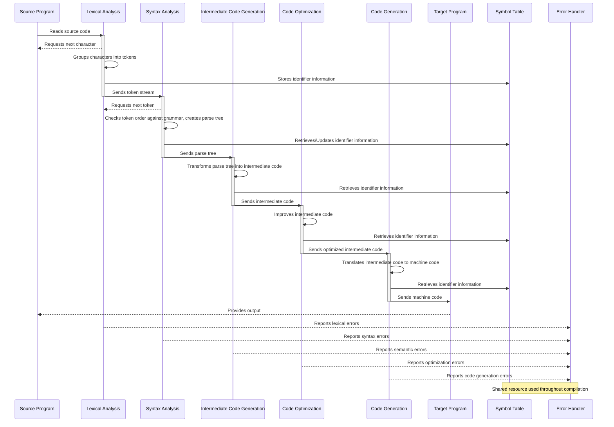

# Understanding the Phases of a Compiler - A Visual Guide

Compilers are complex systems that translate high-level programming languages into machine code that can be executed by a computer. This process involves multiple stages, each with its own responsibility. In this blog post, we will explore the different phases of a compiler, supported by a sequence diagram that visually represents the interactions between these phases.

## **Phases of a Compiler**

A compiler operates in distinct phases, each performing a specific task to convert source code into an executable program. These phases are:

1. **Lexical Analysis**
2. **Syntax Analysis**
3. **Intermediate Code Generation**
4. **Code Optimization**
5. **Code Generation**
6. **Error Handling**
7. **Symbol Table Management**

Below is a sequence diagram illustrating the flow of data and interactions between the various components of a compiler:

## **Phase Breakdown**

### **1. Lexical Analysis**
The first phase of compilation, the **lexical analyzer** (or scanner), reads the raw source code and converts it into tokens. These tokens represent meaningful symbols like keywords, identifiers, and operators. The lexical analyzer also interacts with the **symbol table** to store and retrieve identifiers.

🛠 **Key Responsibilities:**
- Tokenizing input
- Ignoring whitespace and comments
- Reporting lexical errors (e.g., invalid characters, malformed identifiers)

### **2. Syntax Analysis (Parsing)**
The **parser** receives the token stream and verifies whether the sequence follows the grammatical rules of the programming language. It constructs a **parse tree**, which serves as the structural representation of the source program.

🛠 **Key Responsibilities:**
- Checking syntax correctness
- Constructing parse trees
- Handling syntax errors

### **3. Intermediate Code Generation**
Once syntax analysis is complete, an **intermediate representation (IR)** of the program is generated. This IR is typically a low-level, machine-independent representation that bridges the gap between high-level source code and actual machine code.

🛠 **Key Responsibilities:**
- Generating intermediate representation (e.g., Three-Address Code, Abstract Syntax Tree)
- Simplifying complex expressions
- Handling semantic errors (e.g., type mismatches)

### **4. Code Optimization**
The IR is optimized to improve the performance of the final program. Optimization techniques may include loop unrolling, common subexpression elimination, and dead code elimination.

🛠 **Key Responsibilities:**
- Reducing execution time and memory usage
- Eliminating redundant computations
- Performing data-flow analysis

### **5. Code Generation**
In this phase, the optimized IR is translated into the target machine’s assembly language or binary executable code. This stage also involves **register allocation** and instruction selection based on the architecture.

🛠 **Key Responsibilities:**
- Converting IR into machine code
- Allocating CPU registers efficiently
- Performing final optimizations (peephole optimization, etc.)

### **6. Error Handling**
Error detection and recovery occur throughout the compilation process. The **error handler** reports lexical, syntax, semantic, and runtime errors, ensuring robustness.

🛠 **Key Responsibilities:**
- Detecting and reporting errors at each phase
- Implementing error recovery strategies (e.g., panic mode, phrase-level recovery)

### **7. Symbol Table Management**
The **symbol table** is a central repository that stores information about variable names, function definitions, and other identifiers.

🛠 **Key Responsibilities:**
- Storing and retrieving identifier information
- Managing scope and type information
- Assisting semantic analysis and optimization

## **Conclusion**
A compiler is a sophisticated system that goes through multiple stages to translate source code into efficient machine code. By understanding these phases, developers can better appreciate how programming languages work and optimize their own code for performance.

🚀 **Did you find this helpful?** Let us know in the comments and share this with others interested in compiler design!

